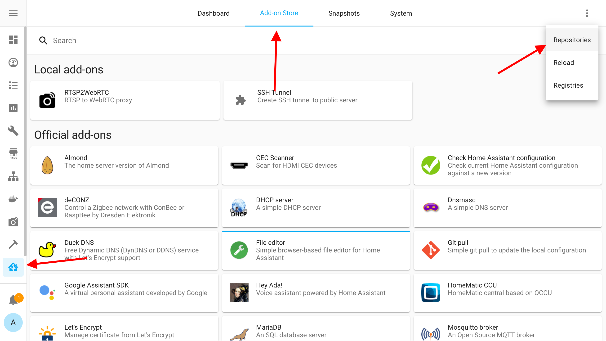

# Olijouve Hass.io addons

- [RTSPtoWSMP4f](https://github.com/olijouve/hassio-addons/tree/master/rtsp2wsmp4f) - watch an [RTSP](https://en.wikipedia.org/wiki/Real_Time_Streaming_Protocol) stream in **real time** 

# Install

You must using [Hass.io](https://www.home-assistant.io/hassio/) - supervised [Home Assistant](https://www.home-assistant.io/) version with addon support.

**Add addon repository**

`https://github.com/olijouve/hassio-addons`

**Install addon**

**Config addon**

